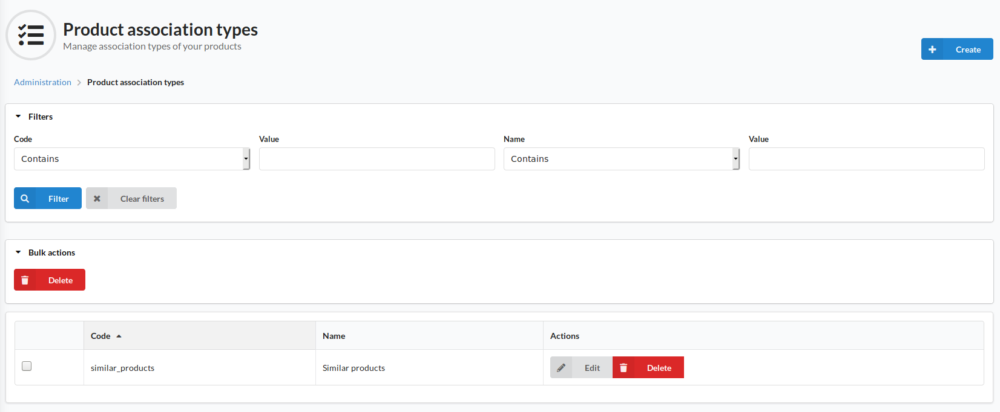

#Product association types
Association types are a method of defining a relationship between products.
The Product association types screen allows admins to create and define these association types.
Note: the actual associations between products are defined on the [Products](../Catalog/Products.md) themselves.
Product associations can be used for traditional associations such as related products and cross sells.

In the top right of this screen is the Create button, which will allow the administrator to create a new association type.
An association type consists of a code to represent the association type as well as a name for the association for each enabled locale

The page has a section at the top for filtering / searching the association types, followed by a grid listing the association types. There is the option to edit and delete each association type.

It should be noted that creating an association type does not automatically get applied to existing or new products; this must be set on the product itself in the Associations tab
