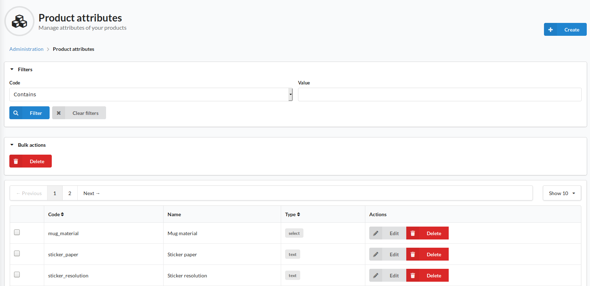

#Product attributes 
The Product attributes area allows admins to create and manage attributes associated to products.

In the top bar of the index page is a filter section to allow the list of attributes to be searched / filtered.

in the top right of the screen is a create button for creating a new attribute. Attributes can be several different types. Some plugins have their own attribute types; these will be documented in their own documentation.
The default attribute types are as follows:
- Text
  - A single line of text. An example might be "Manufacturer Name"
- Textarea
  - A multi-line text input area. This could be use for storing a large amount of text that would be superfluous to the description of the product
- Checkbox
  - A boolean yes/no option. This could be used to represent a binary choice such as "Suitable for outdoor use"
- Integer
  - A numerical input for whole numbers (i.e. not fractions or decimals). This could be used to store a single product dimension such as height
- Percent
  - A numerical percentage used to represent some form of proportion. It should be noted that this figure can go above 100. This could store a figure such as energy efficiency
- Datetime
  - An input that stores a date and time in one field. This could store a value such as the exact moment a product was produced
- Date
  - Similar to Datetime, this field stores a point in time, but only the day, month and year
- Select
  - A list of options that you specify when creating / editing the attribute. You can also chose if the select is a single or multi-select field.

It should be noted that attributes are _not_ used for differentiating product variations: this is handled by [Product Options](../Catalog/Options.md)

It should also be noted that new attributes are not automatically added to new or existing products. To add an attribute to a product, see the [Product](../Catalog/Products.md) page
