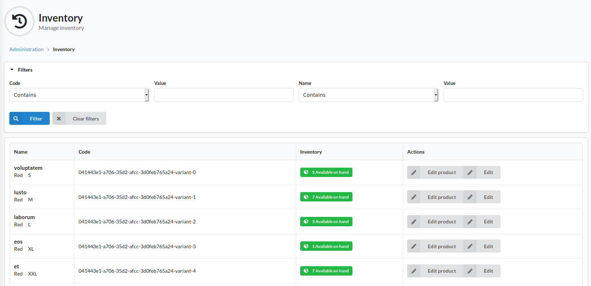

#Inventory
The Inventory area allows admins to track product inventory.

In the top bar of the index page is a filter section to allow the list of stock entries to be searched / filtered.

The grid on the page lists the stock entries per product / variation. It also lists the inventory status for each item, as well as links to edit the parent product or the inventory item itself.

if a product is not listed, and you expect it to be, the "Tracked" switch on the parent is probably set to off. Enable the "Tracked" switch on the product / variant to begin tracking stock.

If a product / variant is not set to be tracked, the customer will not be informed of stock status, and an unlimited number of said product can be purchased.
