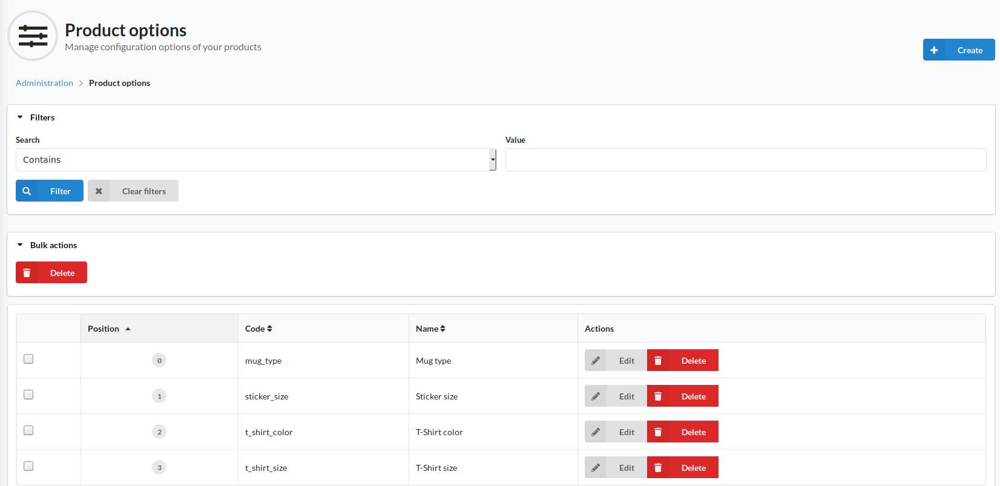

#Product Options

Product options are used for defining the differences between the variations of a product, such as color or size.
The Product Options screen allows an admin to create and manage these options.

In the top right of the page is a Create button for creating new product options.

A product option consists of a code and several values for the option, which of themselves consist of a code and a localised name for each option value.
Once a configurable product has been created it is not possible to amend the options available to define the variants of said product.

Variants of a product _must_ have unique options. As an example, if a T-shirt product has several variants defined by size and color, you cannot create a new variant with "Small" and "Blue" as the options if there is another variant with these exact same options selected.

When a product has variants with options defined, the customer will be presented with a select dropdown for each option when viewing the product
