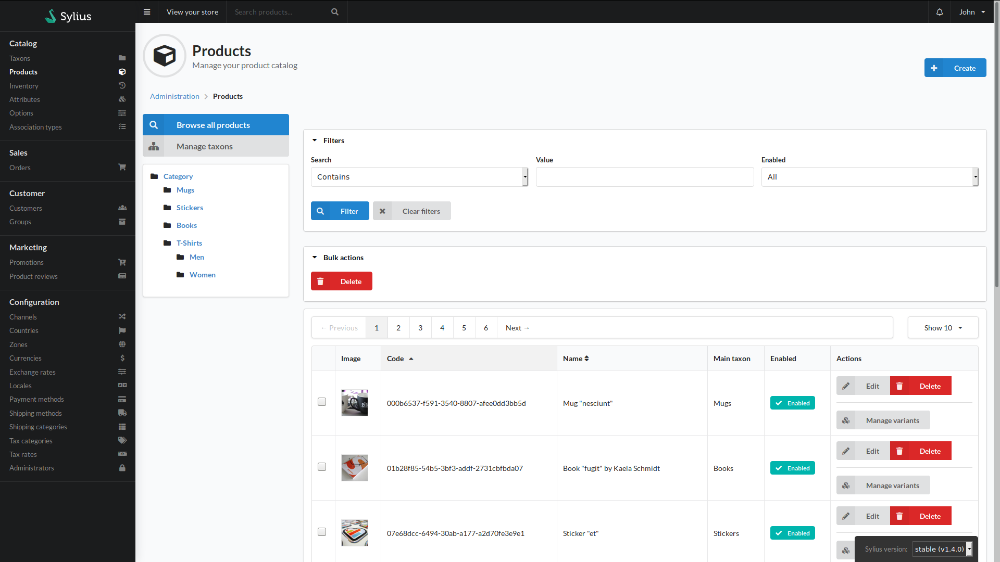
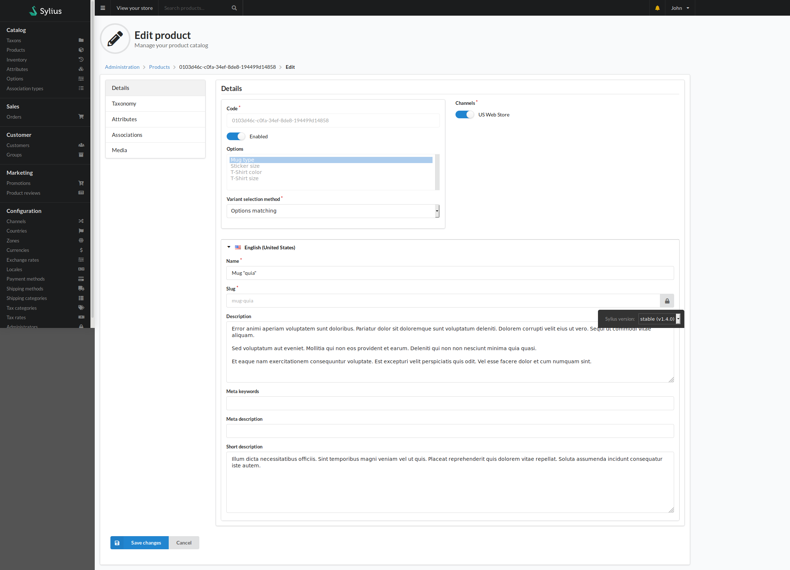

# Products
Product management within Sylius comprises of several screens.

##Product index

The product index page lists the products stored within the system.

On this page you will see on the left the option to reset any filter in effect by clicking the "Browse all Products" button, followed by the "Managed Taxons" button which will bring you to the taxon management area.

Underneath these buttons is a list of product taxonomies. Clicking the name of the taxonomy will filter the products that are associated to the selected taxon.

The right hand section starts with a Create button in the top right. Selecting this shows a menu to select the type of product you wish to create.

Below this is the filter section. In this area you can configure search filters for the product list. To use the filter, select the type of search, the text you want to search for and whether to seach by products based on their status. Clicking filter applies your filter to the product list. Clicking Clear Filters removes any applied filters.

Beneath the filter section is the Bulk Actions area. When you select the checkboxes in the product list and click the buttons in the Bulk Actions area, that bulk action is applied to the selected products.

The main section of the page is the product list proper. There is a pagination area and a dropdown for selection how many products to show at once.
Following this is a table with a row for each product.
You will see:
- The image of the product (if set on the product)
- The product's unique code
- The product's name
- The main taxonomy of the product
- Whether the product is enabled or not
- The action area with several buttons
    - Edit allows you edit the product's details
    - Delete removes the product from the system
    - Manage variants allows you to manage the variations of each product. A variant is a sub product that can be selected from the parent. An example would be different color choices available for the parent. The Manage variants button will open a sub menu in which you can:
        - View a list of variants for the product
        - Create a new variant for the product
        - Generate a new variant copying the details from the parent
    - It is worth noting that even simple products have one variant

## Product Edit

Editing product details is split into several tabs, which can be selected via the left-hand buttons.
The first, and default, tab is details. here you configure core product information.

The top left box is for configuring base product details including it's code, known as SKUs in other systems or whether the product is globally available. Depending on if the product was created as a simple product or a configurable product you will see different options:
- Simple products, and variations, have options for defining stock details:
    - Current stock is the count of how many units of this product are available
    - If Tracked is set to true, the stock changes with the number of sales, and it's stock is manages in the Inventory menu.
    - If Is shipping required is set, it indicates this is a physical product that requires a shipping method to be chosen by the customer.
- Configurable products show a list of options used to differentiate the child variations. To select more than one option hold down the Ctrl key while selecting options. The Variant selection method dropdown has two options:
    - Options matching: The customer will be selected with dropdowns matching the name of the selected options. By selecting the dropdowns the system will match the users choices to the variants and add the variant to the cart.
    - Variant choice: This option will present the customer with a table with radio options listing every product variation by their name and price. It is to be noted this option does not show the option name for the variant.

To the right will be a section consisting of a list of all the channels currently configured in the system. If the chanel is turned on here, this product will be visible in said channel. By default there is a US Web Store channel.

Underneath these two sections will be an accordion row for each Locale within the system. By default this is English (United States). Each locale row contains the localised (translated) product information:
- Name: The product's name
- Slug: the URL identifier of the product. This is different to the product's code.
- Description: The full description of the product
- Meta keywords: Select words that succinctly describe your product. Not visible on the front end but used by crawlers for Search Engine Optimisation
- Meta description: A product description to be used by crawlers in lou of the visible description
- Short description: Depending on your theme, this can be used when not viewing the full product page.
