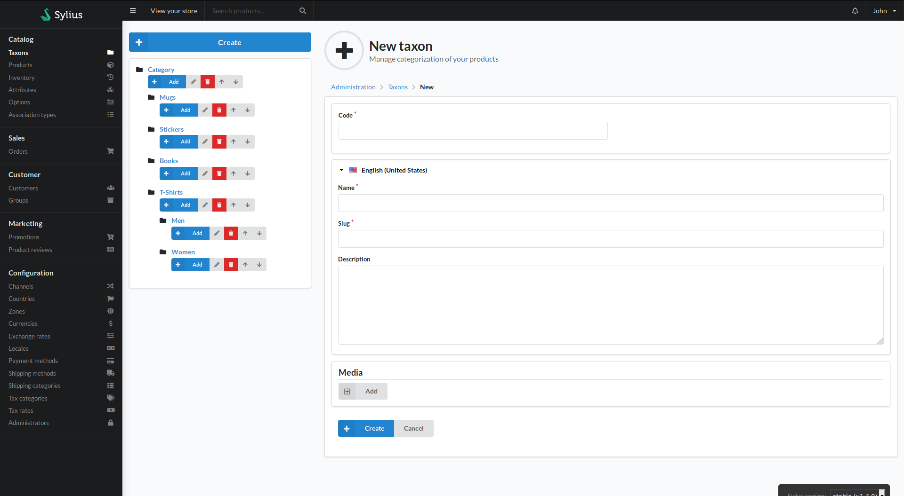

#Taxons
The taxons area allows admins to manage product taxonomies.

In the top left you have a button that will create a new form, seen to the right, to allow a new taxon to be created.

The directory tree on the left has several integrated functions.
- Clicking the name of the taxon (e.g. Stickers) will bring you to a list of products filtered by that taxon.
- Clicking the blue Add button will refresh the form, allowing you to create a new child taxon for the selected taxon.
- Clicking the pencil icon allows for the taxon to be edited
- Clicking the rubbish bin icon deletes the taxon
- The up and down arrows allows the taxons to be ordered

The taxon form itself is for the creation and editing of taxons.
- Code - A unique code for the taxon
- Parent - If this taxon needs to reside underneath another taxon, you select the parent here
- There will then be a section for each locale in the store. For each locale there is
    - Name - The locallised (translated) name of the taxonomy
    - Slug - The URL for the taxon. This is usually generated from the name
    - Description - The localised description of the taxon
- Media - An area to associate media, such as thumbnails, to the taxonomy
