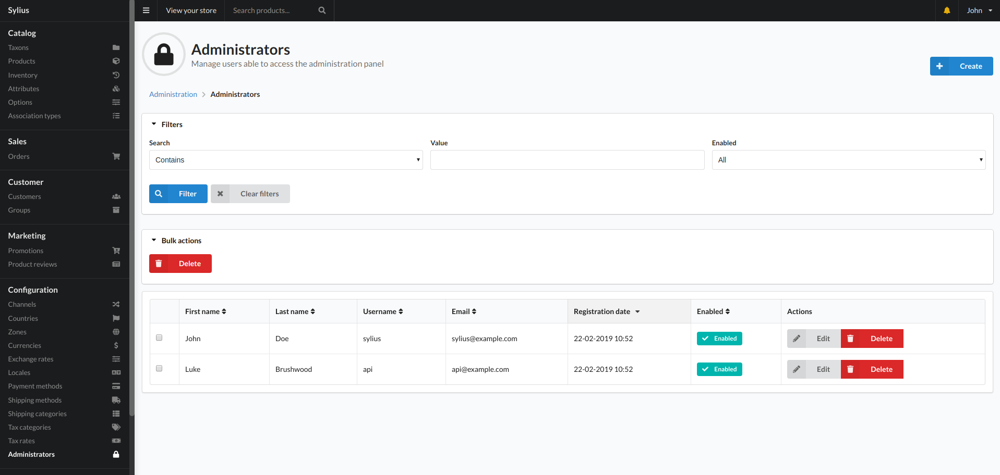
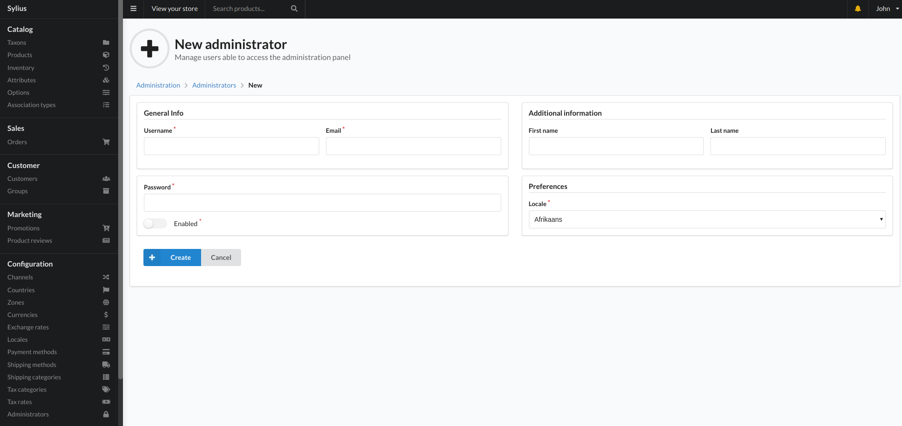

# Administrators

Administrators are users that are able to access the backend of the website that is accessed through the `/admin` route by default.

Administrators are completely separate from Shop users and customers. This means you can be logged into both a shop user and admin user at the same time.

The administrator view give you the ability to filter, edit and delete administrators in the system.

## New Administrator

Clicking create in the top right will allow you to add new administrator user and present you with the below screen.

Fields:
- Username
    - A unique identifier for the user you are creating. This is what the user will use to login with.
- Email
    - Email address for the user.
- Password
    - The password the user will use to login.
- Enabled
    - This option will allow or disallow the user to log into their account.
- First Name
    - Users first name.
- Last Name
    - Users last name.
- Locale
    - This will set the language the system tries to display when that user is logged in. It defaults back to english if there are no translations for the language selected.
