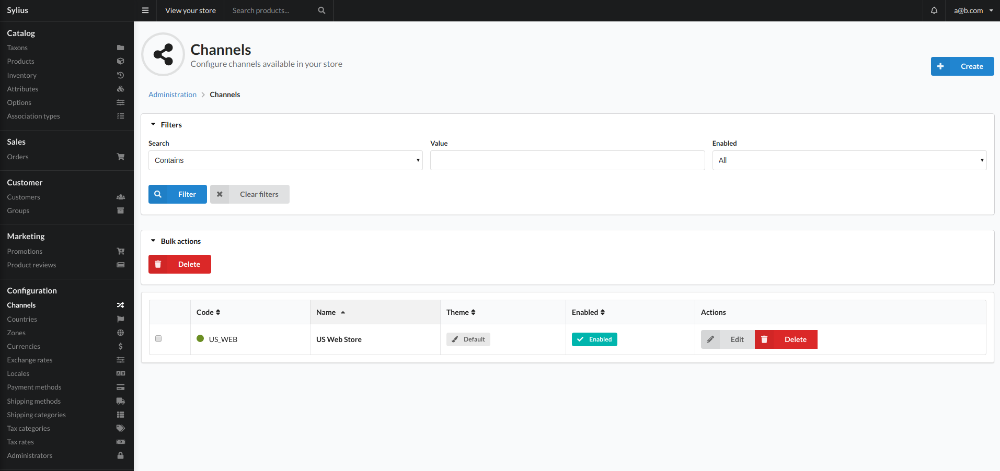
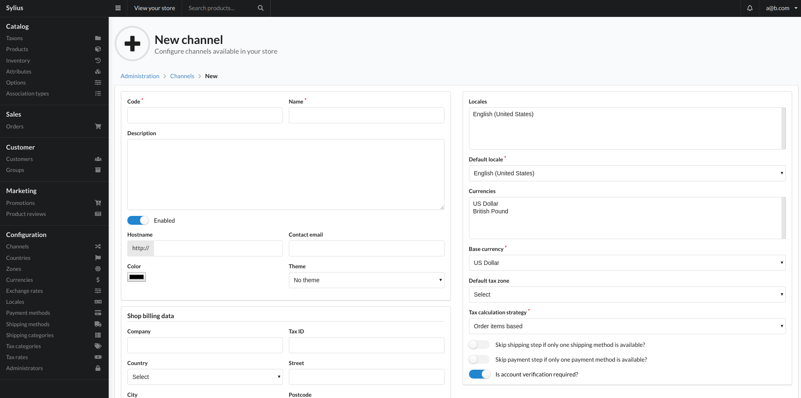

# Channels

A Channel represents a single sales channel which can be one of the following things:

- Webstore
- Mobile Application
- Cashier in your physical store

What may differ between channels? Particularly anything from your shop configuration:

- products,
- currencies,
- locales (language),
- themes,
- hostnames,
- taxes,
- payment and shipping methods.

## Create

To add a channel click the create button top right of the view. This will present you with the below view:

### Fields

- Code
    - Unique identifier for the channel.
- Name
    - An internal identifier for this channel.
- Description
    - Short description of what the channel is for.
- Enabled
    - Whether or not the channel is currently allowed to be used.
- Hostname
    - This is the url on which the channel is accessed.
- Contact Email
    - An email address for the person or persons that manage the channel.
- Color
    - This color is used to conveniently identify a channel in the channel archive view.
- Theme
    - You are able to create different themes for different channels. This allows you to select which theme to use. This will require a developer if more themes are needed.
- Shop billing data
    - This is used if you would like different billing information for different channels.
- Locales
    - This option allows you to select which locales are available to this channel.
- Default Locale
    - This locale will be use if a user accesses this channel without specifying a locale.
- Currencies
    - The currencies that are used by the channel. More currencies can be added in the "Currencies" option in the sidebar.
- Base currency
    - This is the currency that is used to calculate conversion rates.
- Default tax zone
    - The tax zone that this channel will use.
- Tax Calculation strategy
    - TBC
    