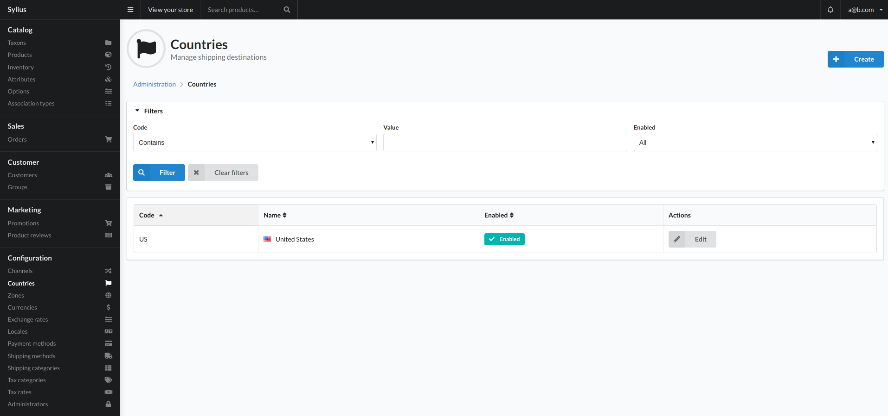
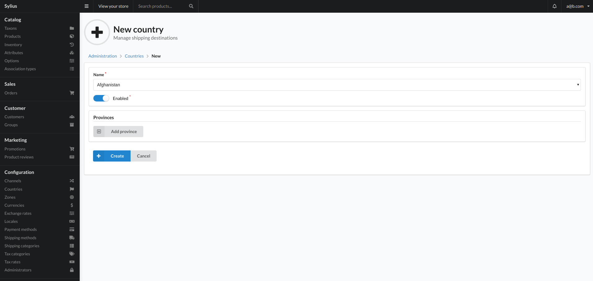

# Countries

A Country represents a real country that your shop is willing to sell its goods in (for example the UK). It has an ISO code to be identified easily (ISO 3166-1 alpha-2).

Countries might also have Provinces, which is in fact a general name for an administrative division, within a country. Therefore we understand provinces as states of the USA, voivodeships of Poland, cantons of Belgium or Bundesländer of Germany.

## Create

To add a country to the system, press the create button top right of the view. You will be taken to the below view:

### Fields

- Name
    - This select field allows you to select the country you would like to add to the system.
- Province
    - This will allow you to add specific states or division ect. To the country.
    - Each province requires 2 fields of data and 1 optional field:
        - Code
            - Unique identifier for the province.
        - Name
            - The name of the province.
        - Abbreviation
            - A short form identifier for the province.