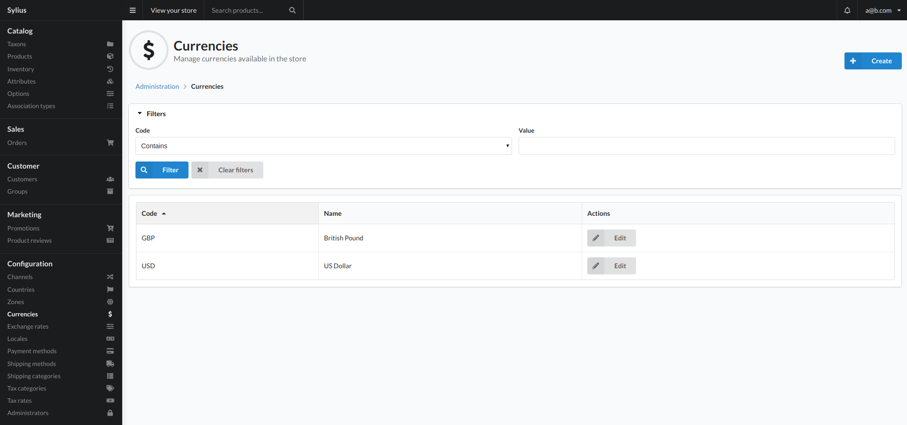
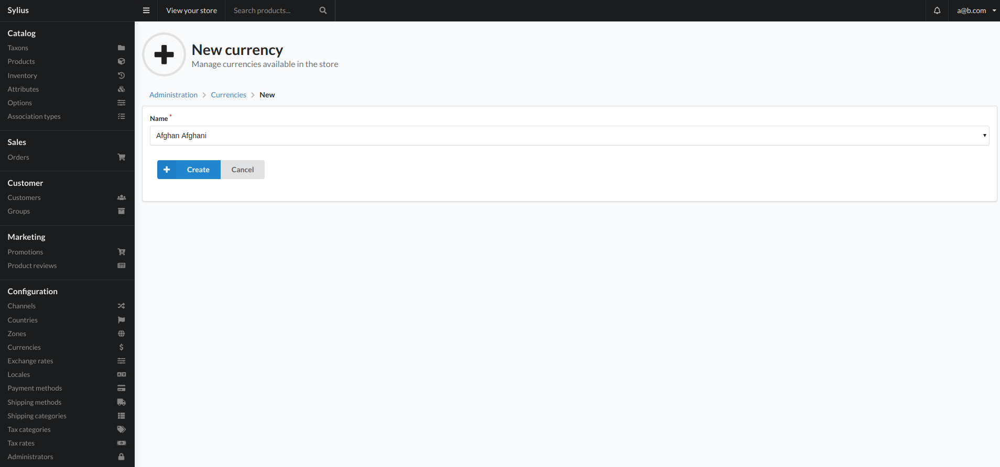

# Currencies

Sylius supports multiple currencies per store and makes it very easy to manage them.

Sylius uses stores all money values in the base currency per channel and converts them to other currencies with exchange rates.

By default, a user can switch the current currency in the frontend of the store.

## Create

To add a currency click the create button top right of the view. This will present you with the below view:

### Fields

- Name
    - The name of the currency you would like to add to the system.   