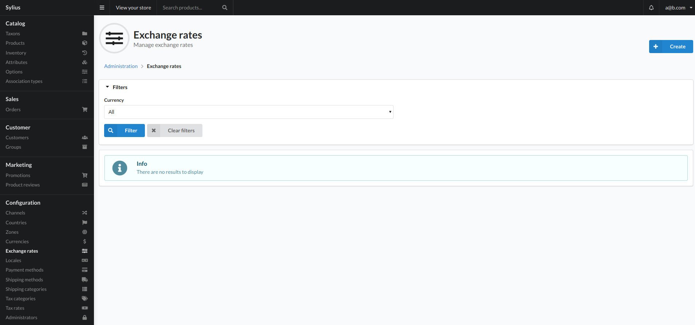
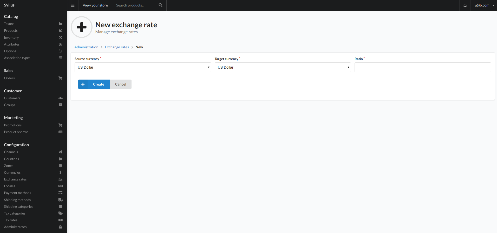

## Exchange rates

Exchange rates are the value in which a currency that is not the default store currency will be converted with.

Exchange rates are used for viewing the approximate price in a currency different from the base currency of a channel.

## Create

To add an exchange rate click the create button top right of the view. This will present you with the below view:

### Fields

- Source Currency
    - This is the currency we are going to change from.
- Target Currency
    - This is the currency we are converting to.
- Ratio
    - This is the ratio to be used when converting the currency.