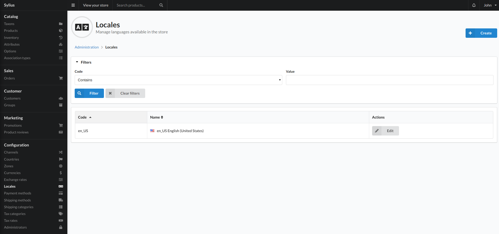
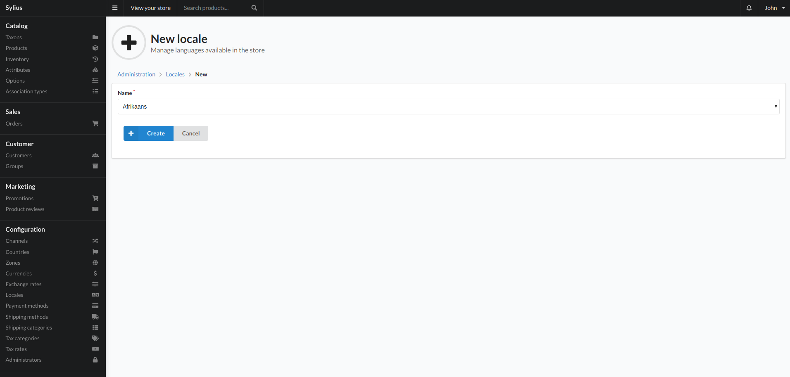

# Locales

Locales are a way to allow Sylius to use multiple languages.

Locales are language codes standardized by the ISO 15897

## Create

To add a locale click the create button top right of the view. This will present you with the below view:

### Fields

- Name
    - This is the name of the language you would like to add to the system.
    - If there is a relevant translation file in your store/theme then when a user chooses this local, sylius will use the translation file to display the store in the users chosen language.