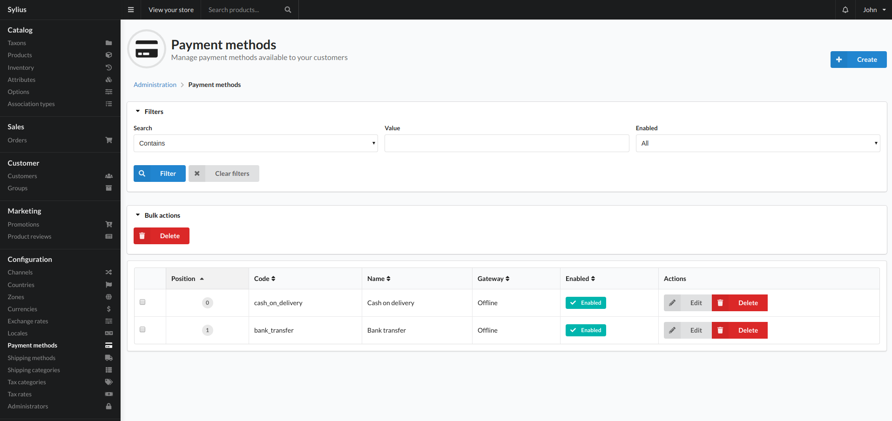
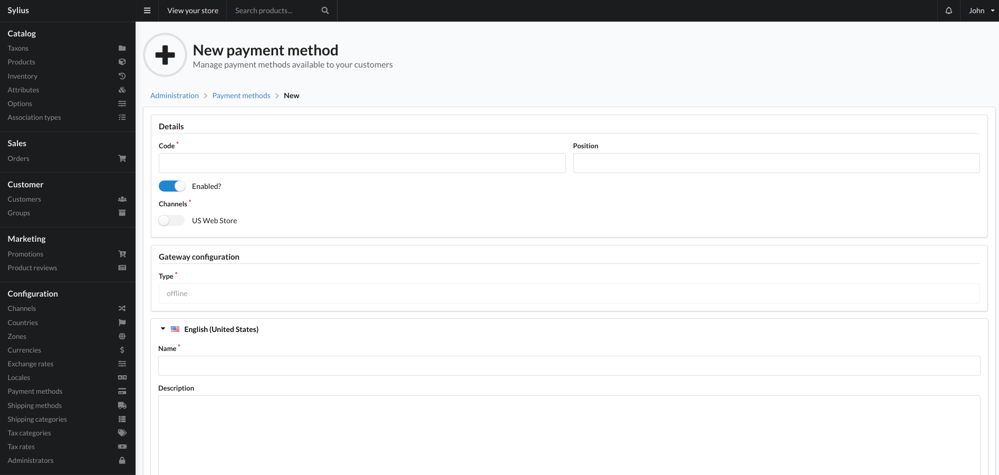

# Payment Methods

Sylius allows developers to integrate a wide range of gateways. If your system has any of these implementations, this is where you configure them.



## Create

To add a payment gateway click the create button top right of this view. From here you are given a list of available payment methods. By default, sylius comes with 3 payment methods:

1. Offline Payments
    - This method is used if you want to accept cheques, bank transfers or cash on delivery. Order progression is manual using this payment gateway.
2. Paypal Express checkout
3. Stripe Checkout

There could be more payment methods to choose if you have added extra plugins or asked a developer to add a bespoke gateway.

Once you have chosen the payment method you would like to add, you will be given the following view:



```text
Please note: This view will vary depending on the method you have chosen and how many options are required to set up that method
```

### Fields

- Code
    - Unique identifier for the payment method.
- Position
    - This is the order that the payment method will be displayed to a user on the checkout.
- Enabled?
    - Whether the payment method can be used on the checkout.
- Channels:
    - The channels that are allowed to use this payment method.
- Gateway Configuration
    - This is where the payment gateway specific settings will be.
- Locale Settings.
    - Depending on how many locales are in the system, this is where you name and describe the method in the language relating to the section.