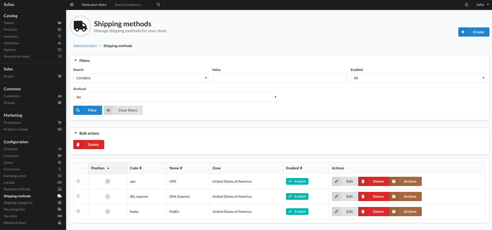
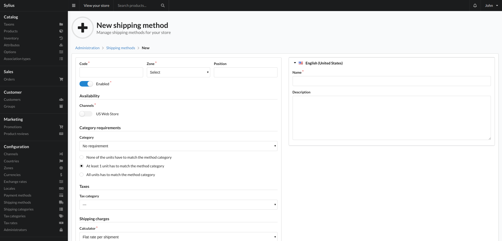

# Shipping Methods

A shipping method allows a fee to be added to an order based on some rules. This is described to the user as a shipping fee.

Shipping method are Zone and channel based. 

## Create

To add a shipping method click the create button top right of this view and you will be taken to the below view:

### Fields

- Code
    - Unique identifier for the shipping method.
- Zone
    - The zone this shipping method is to used in.
- Position
    - The position of the shipping method when displayed to the customer on the checkout.
- Enabled?
    - Whether the shipping method can be used.
- Category Requirements
    - TBC