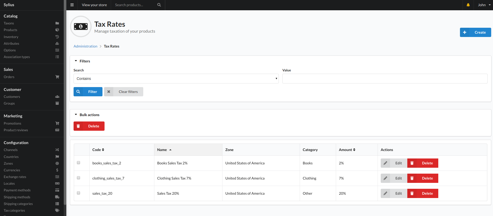
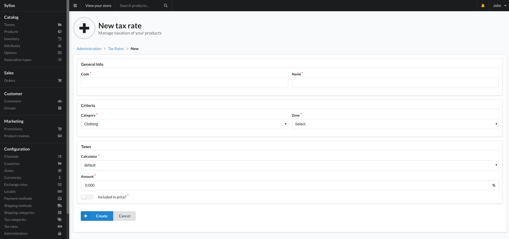

# Tax Rates

Tax rates allow you to specify what tax values apply based on a Tax category and Tax zone. Both Tax categories and Tax zones can be added in the backend.

This allows you to set up different taxes that will be added to a users cart if they match the rules you specify.

This view displays the tax rates that are currently in the system and allows you to filter the list if needed.

## Create

To add a new tax rate, use the create button on the top left of the view and you will be shown the below view:

### Fields

- Code
    - Unique identifier for the tax rate.
- Name
    - A name for the tax rate. This will be displayed to a user on the checkout if they have items in the cart that match the rules of this tax zone.
- Category
    - A category to relate the tax rate to. This will allow the user to see the name and a description of the category during checkout.
- Zone
    - A zone rule that will determine when the tax rate is to be applied. You can add extra Zones in the "Zones" section of "Configuration" in the sidebar.
- Calculator
    - This option allows you to choose what calculation is used when applying the tax rate. At the moment this only consists of "default" which is a percent based tax.
- Amount
    - The percentage of tax that is to be applied by this tax rate.
- Included in price?
    - This option allows you to specify if the price of a product that applies to this rule will have the tax included or if the tax is calculated on the checkout only.