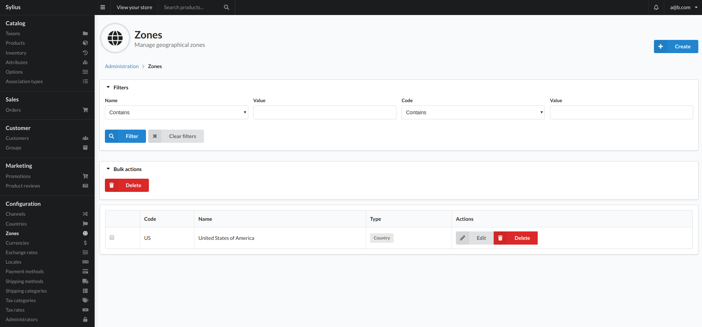
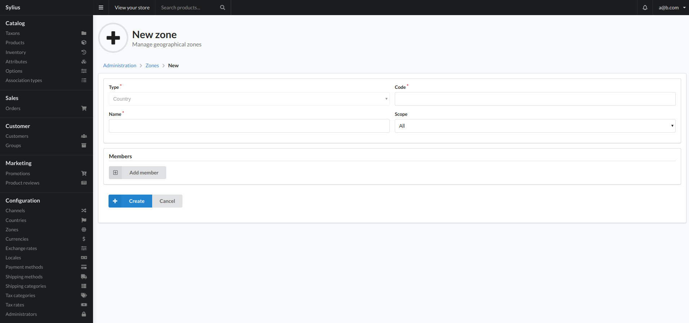

# Zones

Zones consist of ZoneMembers. It can be any kind of zone you need - for instance if you want to have all the EU countries in one zone, or just a few chosen countries that have the same taxation system in one zone, or you can even distinguish zones by the ZIP code ranges in the USA.

Three different types of zones are available:

- country zone, which consists of countries.
- province zone, which is constructed from provinces.
- zone, which is a group of other zones.

## Create

To add a new zones, use the create button on the top right of the view. 

### Fields

- Type
    - This is the type of zone you are creating. The type will depend which option you choose when you pressed the create button on the previous view.
        - "Country" type
            - This will allow you to create a zone from the countries you have added to the system.
        - "Province" type
            - This will allow you to create a zones based on provinces that have been added to countries.
        - "Zone" type
            - This will allow you to create a zone based on other zones added to the system.
- Code
    - Unique identifier for the zone. 
- Name
    - Internal name for the zone.
- Scope
    - TBC
- Members
    - This is where you specify what is a member of the zone you are creating. This will allow you to select options based on the type you chose.

