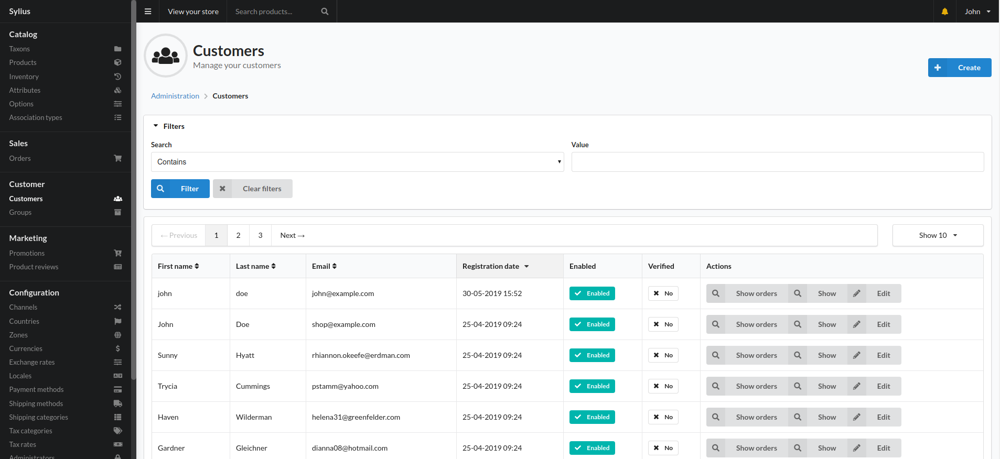
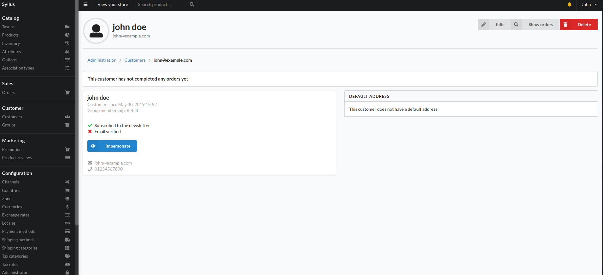
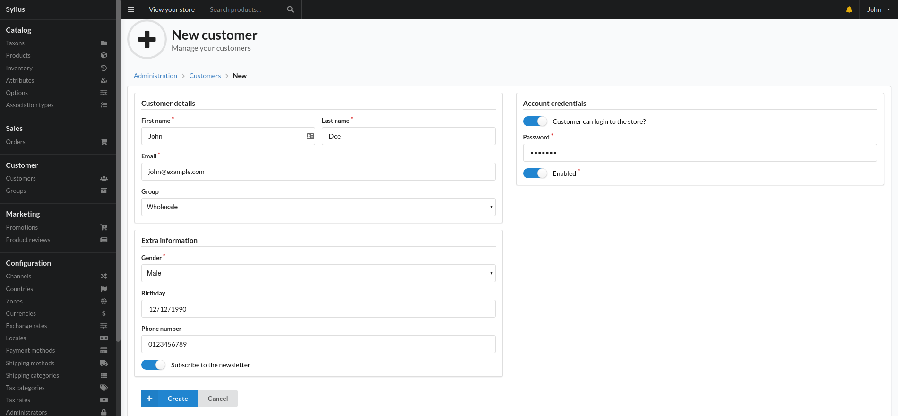

## Customers Index Page

To access this page, find the Customer section in the sidebar menu and click the "Customers" menu item.

On this page you can search customers and create new ones.

The filter searches by email, first name and last name.

Main section of this page is the customers table.

 - first name
 - last name
 - email
 - registration date
 - enabled - whether customer is enabled to log in or not
 - verified - whether customer has verified their email address
 - actions
 
Actions are:
 - show orders - to view related orders
 - show - shows more detail about the customer
 - edit - takes to the edit page
 
 ## Customer Show Page
 
 This page displays details about a single customer.
 
 
 
 ### How to impersonate a customer?
 
 1. Go to the Customer Index Page
 2. Find the customer you want to impersonate using the filter functionality above the table
 3. In the actions column click the "Show" button.
 4. On the next page, click "Impersonate"
 
 This allows you to browse the shop as if you were logged in as the impersonated customer.
 
 ## How to create a new customer?
 
  
 
  1. Go to the Customer Index Page
  2. Click the "Create" button in the top right corner
  3. Fill out the form
  
 Make sure that on the "Account credentials" section:
  - "Customer can login to store" is checked
  - "Enabled" is checked
  - you've entered a password
  
 ## How to edit details about a customer?
 1. Go to the Customer Index Page
 2. Type in the customer's email address in the Search filter; click "Filter"
 3. Find the customer in the customers table and click the "Edit" button in the "Actions" column
 4. Change the relevant fields.
 5. Click the "Save changes" button
 
 ## How to find orders related to a customer?
   1. Go to the Customer Index Page
   2. Type in the customer's email address in the Search filter; click "Filter"
   3. Find the customer in the table below and click the "Show orders" button in the "Actions" column
