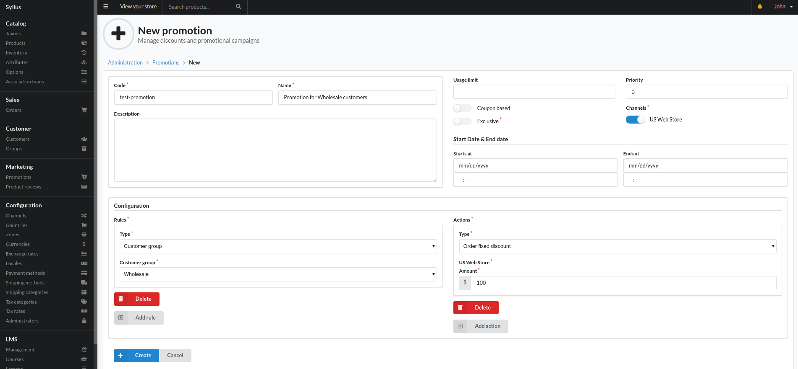
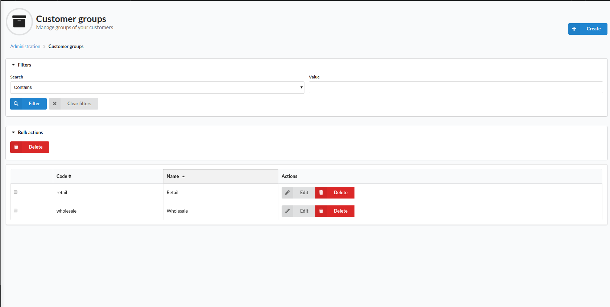
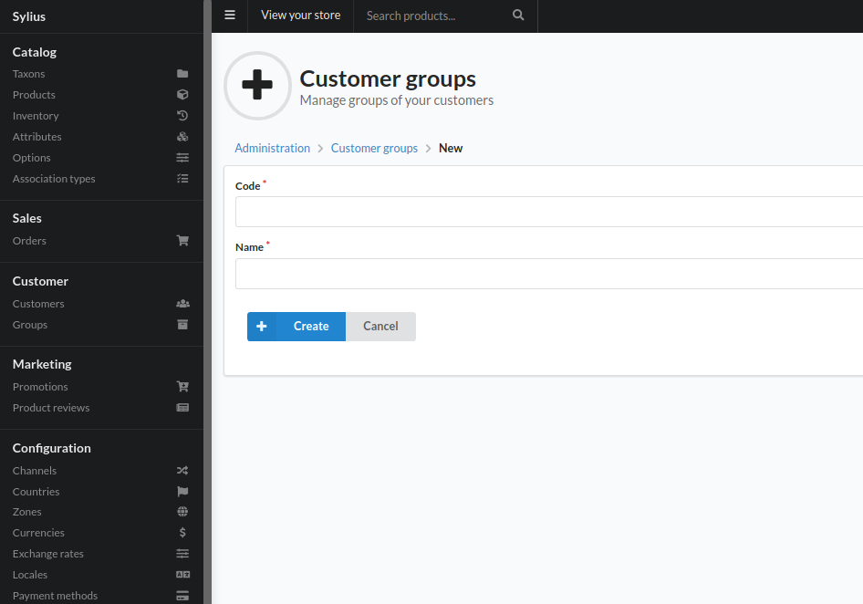
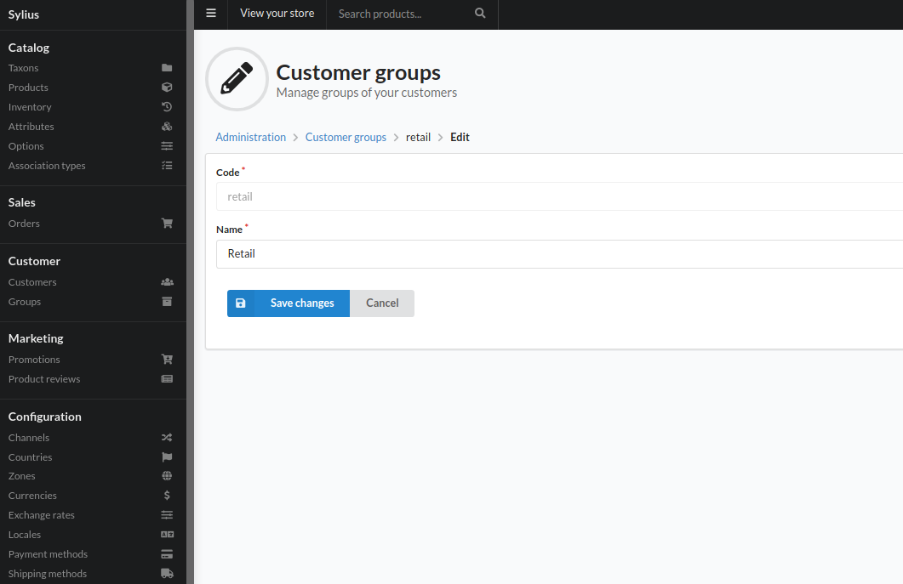

## Customer Groups

Customer Groups provide a way to apply logic to a group of customers. As an example this can be usefull to limit a promotion to a group of customers.

### How to assign a customer to a group?

1. Go to the _Customers_ index page
2. Find the customer you want to add to the group
3. Click _Edit_ in the _Actions_ table
4. In the _Customer details_ section, change the _Group_ dropdown to the new group you want this customer to be in.

### Usage in promotions

The screenshot below demonstrates one usage of customer groups. All customers from the _Wholesale_ group will get a $100 discount on their orders.

Steps involved:
1. Create a new promotion
2. Add a new promotion rule
3. From the _Type_ dropdown select _Customer group_
4. From the _Customer group_ dropdown, select the group you are interested in.

As a result, all _Promotion Actions_ will be applied to customers from the group you've selected.

### Customer Groups Index Page

Standard page to list and search customer groups.

### How to create a new customer group?

1. Go to the Customer Index Page
2. On the top right corner, click the _Create_ button.
3. Specify a code for the customer group. This must be a unique value; no other customer groups can have this code.
4. Specify a name to help you identify this group later on.

  
### How to edit a customer group?

1. Go to the Customer Index Page
2. In the table, find the customer group you want to edit. Use the filters above the table if needed.
3. Click the _Edit_ button in the _Actions_ column
4. Edit the fields you want to change.
5. Click the _Save changes_ button

> Note: the *code* field is not editable.

