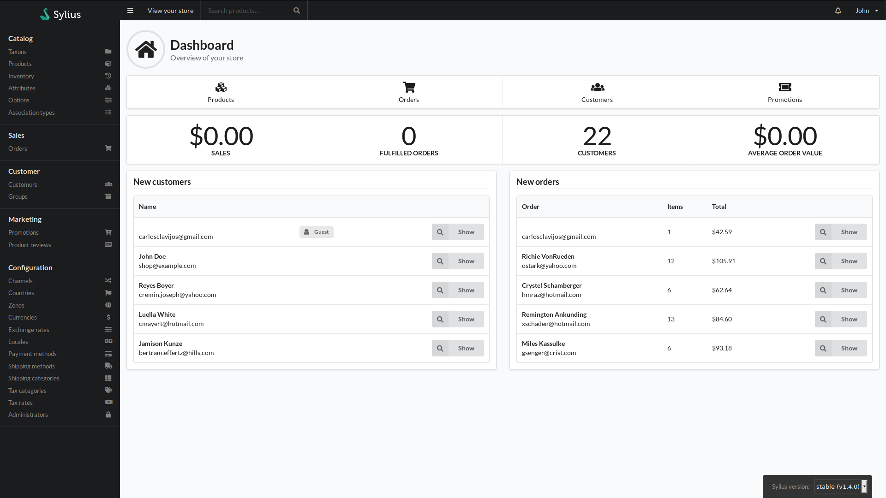

# Admin Dashboard
Once you have successfully authenticated yourself on the [Login screen](Login.md), you will typically see the admin dashbord.

## Left bar
Starting from the logo in the top left downwards you have
- The shop logo, which links back here to the dashboard
- The admin menu and sub items
    - Catalogue - This is where product management and related options are
        - [Taxons](Catalog/Taxons.md) - Where you manage the taxons, colloquially referred to as categories in similar eCommerce systems, for the products are managed.
        - Products - Where the products are managed.
        - Inventory - Management of stock levels for products that have marked the quantity as tracked.
        - Attributes - The management for the various linked characteristics for products. As an example washing instructions and/or manufacturer would be applicable for a clothing product.
        - Options - The management for product options. Similar to Attributes, options are also used for product selection options. An example of possible options would be size or color.
        - Association Types - You can associate products to other products through associations. An example association type would be 'similar products'.
    - Sales - This is where sales are managed
        - Orders - Shows the customer orders placed within the system
    - Customer - Customer related configuration
        - Customers - This is where the list of customers can be viewed and edited
        - Groups - Define groups that customers can reside within
    - Marketing - Marketing related functions
        - Promotions - Sales and Catalogue rules that allow for discounts and other amends to customer orders. This includes coupons
        - Product Reviews - Management of reviews on products left by the general public
    - Configuration - System level options
        - Channels - Management of the different store views or websites
        - Countries - Management of shipping destinations. Also manages provinces
        - Zones - Management of geographical areas. Several countries can be members of a zone
        - Currencies - Management of the different currencies available
        - Exchange rates - Management of the ratios that convert one currency to another
        - Locales - Management of the different languages available on the site
        - Payment methods - Management of the different payment gateways available
        - Shipping Methods - Management of the different shipping options for orders
        - Shipping categories - Products can reside in a shipping category (e.g. "Large items" for products that are pallet sized). Shipping methods that have a category set will then change depending on the products in the cart
        - Tax categories - Management of taxes within the system
        - Administrators - Management of admin users
        
__If you have more options than what are listed here, you probably have custom plugins in use. Contact the supplier for instructions on these bespoke options__

## Top bar

To the right of the logo you have the following:
- Burger icon - This icon of three lines collapses and expands the left menu
- View your store - Links to the public facing store
- Product search - Type in text and press the enter key to get a result list of products
- Bell icon - Notification area. When the icon is gold in color it means there is a new notification.
- User dropdown - Click to reveal a menu to either view your account or logout.

## Main area

The dashboard proper contains the following elements:
- A bar that provides quick links to products, orders, customers and promotions
- A bar showing system metrics like total sale values
- A box that shows the latest customers to register
- A box showing the latest orders in the system
