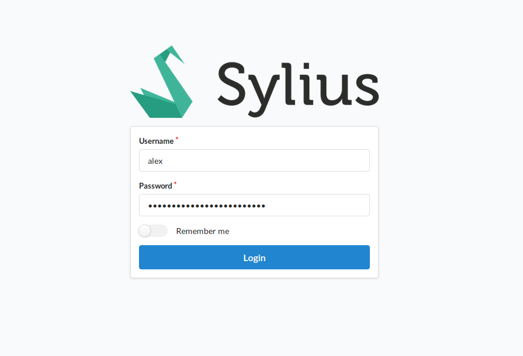

# Admin Login

To access the back end of Sylius you must first login.

*Remember: the login page is different for customers to admins*

Typically, the admin panel and admin login can be reached at `/admin` on your domain, unless this has been manually changed.
As an example, the admin panel for `https://demo.sylius.com` would be `https://demo.sylius.com/admin`.

If you have logged out, or not logged in, you should see a login screen.

Here you can see the following:

- The store logo
- An input for your admin username
- An input for your admin password
- An option switch to remember your login, so that you will not need to login again upon returning to the admin panel.
- A login button

After entering your username and password you can either press the return key or the login button to submit your details.

If the credentials were correct you will be sent onwards to the dashboard, otherwise you will be shown an error in regards to what aspect of the login did not work.
