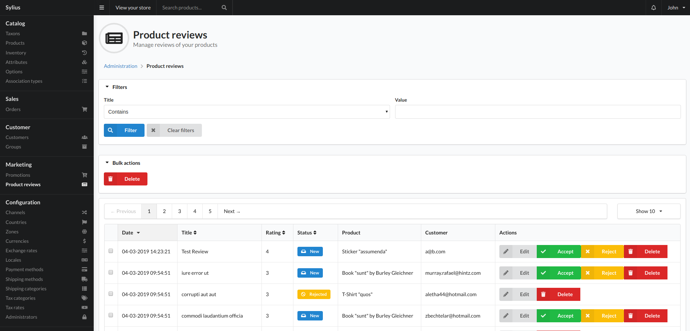
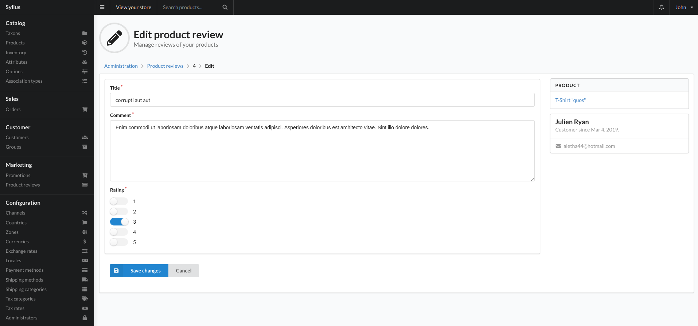

# Product Reviews

Product Reviews are a marketing tool that let your customers give opinions about the products they buy in your shop. They have a rating and comment.

The rating of a product review is required and must be between 1 and 5.

Reviews have 3 states. `new`, `accepted`, and `rejected`.

When a review is submitted, the review will be created in the admin, and set to the `new` state. The review does not appear on the frontend and the user is given a message letting them know their review was sent successfully and it is awating "acceptation"

An admin can then log into the backend and see the review.

From here you can view, edit, delete, accept, reject or delete a review.

When a review is accepted, it will modify the related products average rating, and the review will appear on the product on the frontend.

When a review is rejected, the products average rating will not be affected and the review will not appear on the product.

When a review is deleted, the products average rating will be updated and the review will no longer be available in the system.

Once a review is accepted or declined, the state can no longer be changed. The review can still be deleted however.

## Editing

When you press edit on a review you are presented with the following view:

You can see the product a review is related to.

If the user was logged into their account when they added the review, you will see the customers name with a link to that customer.

### Fields

- Title
    - Title of the review given by the user when the filled out the review form on the frontend.
- Comment
    - Main body of the users review.
- Rating
    - The rating chosen by the user when filling the review form out.