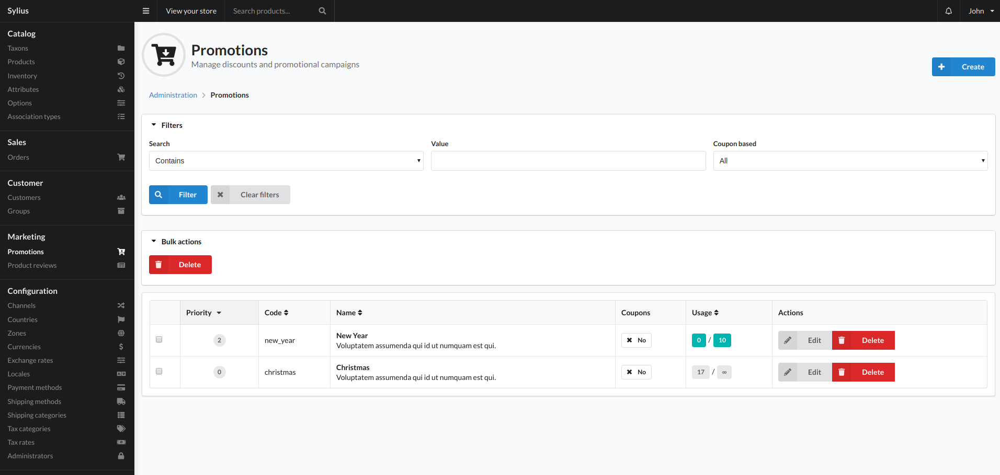
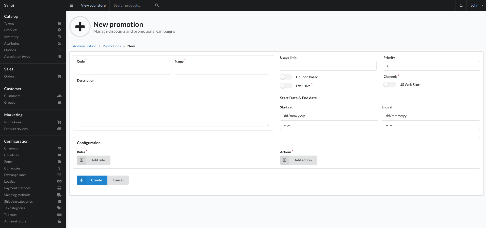

# Promotions

Promotions is where you add any special offers to your store. This could be something like a 50% off coupon, or a limited time offer between dates.

## Create

To add a shipping category click the create button top right of this view and you will be presented with the below view:

### Fields

- Code
    - Unique identifier for the promotion.
- Name
    - Name for the promotion. This will be displayed to the customer when their basket is eligible for this promotion.
    - If the promotion is a coupon based promotion, this is the string the user needs to enter on the checkout to apply the promotion.
- Description
    - Description that is also displayed to the user on checkout if their basket is eligible.
- Usage limit
    - The Usage Limit of a promotion is the total number of times this promotion can be used.
- Priority
    - Promotion priorities are numbers that you assign to the promotion. The larger the number, the higher the priority. So a promotion with priority 3 would be applied before a promotion with priority set to 1.
-  Coupon based?
    - This will set the promotion to require the user to add the promotion name into the coupon box on checkout to apply the promotion.
- Exclusive?
    - This make the promotion only eligible on its own. You cannot mix this promotion with other promotions.
- Channels
    - The channels this promotion is available on.
- Start Date
    - The date the promotion is valid from.
    - Before this date, the promotion cannot be applied.
- End Date
    - The date the promotion is valid to.
    - After this date the promotion cannot be applied.
- Configuration
    - Rules
        - These are the rules that determine if a promotion should be added to the user cart. 
        - You can add many rules to a promotion.
        - There are many rule types you can use.
            1. Cart Quantity. This will mean the promotion requires X amount of items in the basket to be applied.
            2. Customer Group. This means the customer completing the order has to be in a specific customer group for it to apply.
            3. Nth Order. This means the customer has to have X orders previously for this promotion to apply.
            4. Shipping Country. This means the order has to be shipped to a specified country to apply.
            5. Has at least one from taxons. This means the user needs to have at least 1 item from a chosen taxon for the promotion to apply.
            6. Total price of items from taxon. This means the user has to have a specified value of items from one taxon in the basket for the promotion to apply.
            7. Contains Product. This means the user has to have at least 1 of a specific product in the basket to apply the promotion.
            8. Item total. This means the value of the baskets items has to X for the promotion to apply.
    - Actions
        - These actions are what happens when a promotion is applied.
        - You can add many actions to a promotion.
        - There are many action types you  can use:
            1. Order fixed discount. This will reduce the order total by the value entered.
            2. Item fixed discount. This will reduce an items price in the basket by a certain amount.
            3. Order percentage discount. This will reduce the order total my a percentage.
            4. Item percentage discount. This will reduce an items price in the basket by a percentage.
            5. Shipping percentage discount. This will redice the Shipping charge by a percentage.